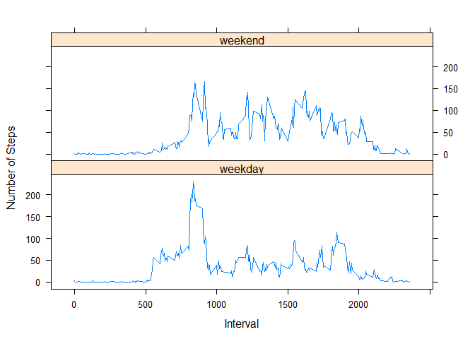

# Reproducible Research: Peer Assessment 1
By Christian Beassoum 


## Loading and preprocessing the data

1. Loading the data (unzip first)

```r
unzip("activity.zip")
data <- read.csv("activity.csv", colClasses = c("integer", "Date", "factor"))
str(data) # Number of observations and variables in the dataset (17,568 -- 3)
```

```
## 'data.frame':	17568 obs. of  3 variables:
##  $ steps   : int  NA NA NA NA NA NA NA NA NA NA ...
##  $ date    : Date, format: "2012-10-01" "2012-10-01" ...
##  $ interval: Factor w/ 288 levels "0","10","100",..: 1 226 2 73 136 195 198 209 212 223 ...
```

2. Processing/transforming the data

For the two next blocks of questions we need to ignore the missing values in the dataset.

```r
noNA <- na.omit(data) # noNA is the dataset with missing values removed
str(noNA) # Number of observations and variables in the dataset with missing values ignored
```

```
## 'data.frame':	15264 obs. of  3 variables:
##  $ steps   : int  0 0 0 0 0 0 0 0 0 0 ...
##  $ date    : Date, format: "2012-10-02" "2012-10-02" ...
##  $ interval: Factor w/ 288 levels "0","10","100",..: 1 226 2 73 136 195 198 209 212 223 ...
##  - attr(*, "na.action")=Class 'omit'  Named int [1:2304] 1 2 3 4 5 6 7 8 9 10 ...
##   .. ..- attr(*, "names")= chr [1:2304] "1" "2" "3" "4" ...
```


## What is mean total number of steps taken per day?
Here, we ignore the missing values in the dataset.

1. Calculate the total number of steps taken per day

```r
totalSteps <- aggregate(noNA$steps, list(Date=noNA$date), FUN="sum")$x
```

2. Make a histogram of the total number of steps taken each day

```r
hist(totalSteps, main="Histogram of Total Number of Steps Taken Each Day", 
     col="lightblue", border="black")
```

 

3. Calculate and report the mean and the median of the total number of steps taken per day

Mean total number of steps taken per day:

```r
mean(totalSteps)
```

```
## [1] 10766.19
```

Median total number of steps taken per day:

```r
median(totalSteps)
```

```
## [1] 10765
```


## What is the average daily activity pattern?
Again, we ignore the missing values in the dataset.

1. Make a time series plot of the 5-minute interval (x-axis) and the average number of steps taken, averaged across all days (y-axis)
* Average number of steps per day: 

```r
avgSteps <- aggregate(noNA$steps, by = list(interval = as.numeric(as.character(noNA$interval))), FUN="mean")
names(avgSteps)[2] <- "meanSteps"
plot(avgSteps$interval, avgSteps$meanSteps, type="l", main = "Average Number of Steps Taken Across All Days by 5-minute Intervals", xlab = "Interval", ylab="Number of Steps")
```

 

2. Which 5-minute interval, on average across all the days in the dataset, contains the maximum number of steps?

```r
avgSteps[avgSteps$meanSteps == max(avgSteps$meanSteps), ]
```

```
##     interval meanSteps
## 104      835  206.1698
```


## Imputing missing values

1. Calculate and report the total number of missing values in the dataset.

```r
sum(is.na(data))
```

```
## [1] 2304
```

2&3. Devise a strategy of filling in all the missing values in the dataset.
Create a new dataset that is equal to the original dataset but with the missing data filled in.

I choose to fill in the missing data with the average number of steps taken by the 5-minute interval, as calculated above (rounded with no decimal).


```r
newData <- data
for (i in 1:nrow(newData)) {
        if (is.na(newData$steps[i])) {
                newData$steps[i] <- round(avgSteps[which(newData$interval[i] == avgSteps$interval), ]$meanSteps)
        }
}
nrow(newData)
```

```
## [1] 17568
```

```r
head(newData)
```

```
##   steps       date interval
## 1     2 2012-10-01        0
## 2     0 2012-10-01        5
## 3     0 2012-10-01       10
## 4     0 2012-10-01       15
## 5     0 2012-10-01       20
## 6     2 2012-10-01       25
```

```r
sum(is.na(newData))
```

```
## [1] 0
```

4. Make a histogram of the total number of steps taken each day and calculate and report the mean and median total number of steps taken per day. Do these values differ from the first part of the assignment? What is the impact of omputing missing data on the estimates of the totak daily number of steps?


```r
newTotalSteps <- aggregate(newData$steps, list(Date=newData$date), FUN="sum")$x
hist(newTotalSteps, main="Histogram of Total Number of Steps Taken Each Day with Imputed Data", 
     col="lightgreen", border="black")
```

 

```r
newMean <- mean(newTotalSteps)
newMean
```

```
## [1] 10765.64
```

```r
newMedian <- median(newTotalSteps)
newMedian
```

```
## [1] 10762
```

```r
oldMean <- mean(totalSteps)
oldMedian <- median(totalSteps)
changeMean <- newMean - oldMean
changeMean
```

```
## [1] -0.549335
```

```r
changeMedian <- newMedian - oldMedian
changeMedian
```

```
## [1] -3
```

After missing data imputation, the mean (median) become lesser than the old mean (median).

## Are there differences in activity patterns between weekdays and weekends?

We continue with the new dataset.

1. Create a new factor variable in the dataset with two levels - "weekday" and "weekend" indicating whether a given date is a weekday or weekend day.


```r
Sys.setlocale("LC_TIME", "English") # My system in non-english so I have to first convert date system in English
```

```
## [1] "English_United States.1252"
```

```r
newData$weekdays <- factor(format(newData$date, "%A"))
levels(newData$weekdays)
```

```
## [1] "Friday"    "Monday"    "Saturday"  "Sunday"    "Thursday"  "Tuesday"  
## [7] "Wednesday"
```

```r
levels(newData$weekdays) <- list(weekday = c("Monday", "Tuesday", "Wednesday", "Thursday", "Friday"), weekend = c("Saturday", "Sunday"))
levels(newData$weekdays)
```

```
## [1] "weekday" "weekend"
```

```r
table(newData$weekdays)
```

```
## 
## weekday weekend 
##   12960    4608
```

2. Make a panel plot containing a time series plot of 5-minute interval (x-axis) and the average number of steps taken, averaged across all weekday days or weekend days (y-axis)


```r
avgSteps <- aggregate(newData$steps, list(interval = as.numeric(as.character(newData$interval)), weekdays = newData$weekdays), FUN = "mean")
names(avgSteps)[3] <- "meanSteps"
library(lattice)
xyplot(avgSteps$meanSteps ~ avgSteps$interval | avgSteps$weekdays, layout = c(1, 2), type ="l", xlab = "Interval", ylab = "Number of Steps")
```

 

